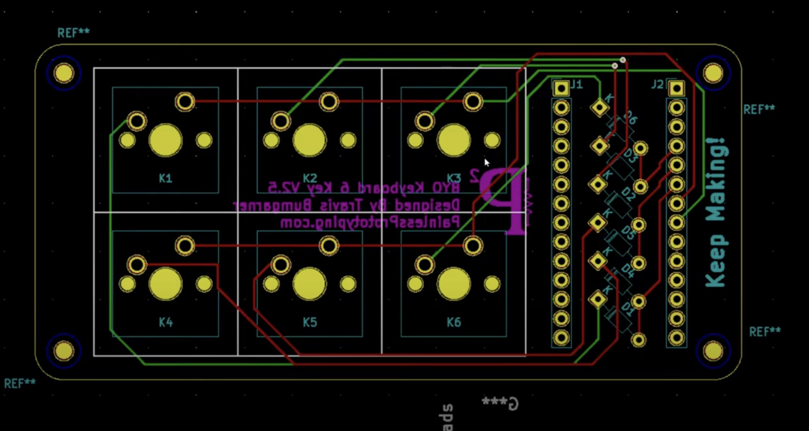

# BYO_keyboard_kit

The BYO keyboard was a [succesfull kickstarter](https://www.kickstarter.com/projects/painlessprototyping/byo-build-your-own-mechanical-keyboard) for a 6 key or 9 key keyboard

Github: https://github.com/painlessprototyping/byo_keyboard_code

**Microprocessor: ItsyBitsy M0 Express**

ItsyBitsy M0 Express Additional Information
- https://learn.adafruit.com/introducing-itsy-bitsy-m0
- https://github.com/adafruit/Adafruit-ItsyBitsy-M0-PCB
  
## Modifications

Solder 2 wires to pins 0 and 1 on the microcontroller. (TX/RX). 

Wire up those pins as shown below. 

For debugging on a computer, wire up to a USB to TTL logic converter like the USB Bub. Use RealTerm(windows) or CoolTerm(mac) to view the output of the serial port

For connecting to a tesmart, use a RS232 to TTL adapter

- [RS232-TTL (Amazon)](https://www.amazon.com/dp/B07BJJ1T5G?psc=1&ref=ppx_yo2ov_dt_b_product_details)

It can be programed with either arduino or micropython. 

Device can be programmed with either python or arduino

## Circuit Python

See [these instructions](https://github.com/painlessprototyping/byo_keyboard_code/tree/master/byo_sample_code/circuit_python) for setting up circuit python 7.x on the board

Once circuit python is running on the board, a new flash device will appear on your desktop. 

1. Copy `adafruit_hid/`, `adafruit_dotstar.mpy` and `adafruit_matrixkeypad.mpy` from the downloaded circuitpython zip to the `lib` folder on the device
2. Edit `code.py` on the flash device

The code will load instantly and automatically reboot the micro controller
